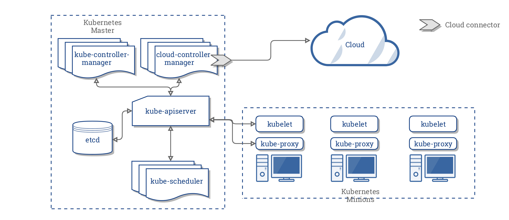
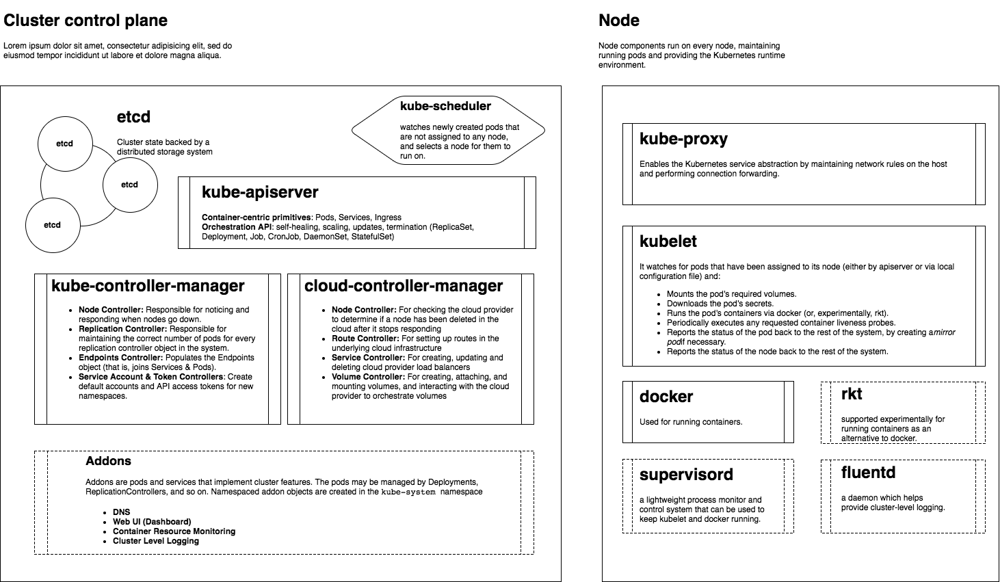

# Local Kubernetes Environment on Vagrant/Virtualbox and CentOS 7

## Kubernetes Architecture



## HOW TO
- [Config File](config.rb)
- [Vagrantfile](vagrant/)

```
$ make up
$ make load
$ make whoup
$ make ssh
$ make down
$ make destroy

# K8s Dashboard
$ kubectl proxy

# K8s bash completion
$ source <(kubectl completion bash)
 
$ kubectl get nodes
...
```

## Tested on:
- VirtualBox 5.2.6
- Vagrant 2.0.1
- CentOS 7.4
- Docker 1.12.6
- Kubernetes 1.9.2
- Flannel 0.9.1

## Supported Configurations
- Master + Workers (worker_count > 0)
- Master Isolation (worker_count = 0)

## TODO List

### Fundamental
- [x] Kubernetes Dashboard
- [x] Grafana + InfluxDB
- [x] Ingress Controller

### Configuration Samples and Keynotes
- [x] Application (Deployment, Service, Ingress Rules)
- [x] Networking (ClusterIP, ExternalIP, NodePort)
- [x] Users
- [ ] Secrets
- [ ] ConfigMap
- [ ] Storages / GlusterFS
- [ ] RBAC
- [ ] Helm Tiller
- [x] Prometheus

## Documentation References

### Kubernetes Architecture
- https://github.com/kubernetes/community/blob/master/contributors/design-proposals/architecture/architecture.md
- https://github.com/kubernetes/kubernetes/blob/release-1.5/docs/design/architecture.md
- https://github.com/kubernetes/kubernetes/blob/release-1.5/docs/design/clustering.md
- https://kubernetes.io/docs/concepts/overview/components/
- https://kubernetes.io/docs/concepts/architecture/cloud-controller/

### Basic Installation and Configuration
- https://kubernetes.io/docs/setup/independent/install-kubeadm/
- https://kubernetes.io/docs/setup/independent/create-cluster-kubeadm/
- https://kubernetes.io/docs/setup/independent/troubleshooting-kubeadm/

### A Pod Network Addon (CNI)
- [Flannel](https://github.com/coreos/flannel)
- [Flannel Vagrant Settings](https://github.com/coreos/flannel/blob/master/Documentation/troubleshooting.md#vagrant)
- [Weave](https://www.weave.works/docs/net/latest/kubernetes/kube-addon/)

### Kubernetes Objects (Kinds) and Operations
Primitives:

- [Pod](https://kubernetes.io/docs/concepts/workloads/pods/pod-overview/)
- [Assigning Pods to Nodes](https://kubernetes.io/docs/concepts/configuration/assign-pod-node/)

Controllers:

- [ReplicationController](https://kubernetes.io/docs/concepts/workloads/controllers/replicationcontroller/)
- [ReplicaSet](https://kubernetes.io/docs/concepts/workloads/controllers/replicaset/)
- [HorizontalPodAutoscaler](https://kubernetes.io/docs/tasks/run-application/horizontal-pod-autoscale/)
- [Deployment](https://kubernetes.io/docs/concepts/workloads/controllers/deployment/)
- [StatefulSet](https://kubernetes.io/docs/concepts/workloads/controllers/statefulset/)
- [DaemonSet](https://kubernetes.io/docs/concepts/workloads/controllers/daemonset/)

Volumes:

- [PersistentVolume](https://kubernetes.io/docs/concepts/storage/persistent-volumes/)
- [PersistentVolumeClaim](https://kubernetes.io/docs/concepts/storage/persistent-volumes/#persistentvolumeclaims)
- [PV/PVC Walkthrough](https://kubernetes.io/docs/tasks/configure-pod-container/configure-persistent-volume-storage/)

### Kubernetes Dashboard
- https://github.com/kubernetes/dashboard
- https://github.com/kubernetes/dashboard/wiki/Creating-sample-user

### Grafana and InfluxDB
- https://github.com/kubernetes/heapster
- https://github.com/kubernetes/heapster/blob/master/docs/influxdb.md
- https://kubernetes.io/docs/tasks/run-application/update-api-object-kubectl-patch/

### Ingress Controller
- https://kubernetes.io/docs/concepts/services-networking/ingress/
- https://github.com/kubernetes/ingress-gce/blob/master/BETA_LIMITATIONS.md#glbc-beta-limitations
- https://github.com/kubernetes/ingress-nginx/tree/master/deploy
- https://github.com/nginxinc/kubernetes-ingress/blob/master/examples/multiple-ingress-controllers/README.md

### Kubernetes Storage
- https://kubernetes.io/docs/concepts/storage/volumes/
- https://kubernetes.io/docs/concepts/storage/persistent-volumes/

### Kubernetes Tutorials
- https://kubernetes.io/docs/tutorials/
- http://katacoda.com/courses/kubernetes
- https://www.edx.org/course/introduction-kubernetes-linuxfoundationx-lfs158x?gclid=EAIaIQobChMI06mUq96K2QIViKMYCh0B6wl9EAMYASAAEgKRFfD_BwE

### Other
- https://kubernetes.io/docs/reference/kubectl/cheatsheet/
- https://github.com/Praqma/LearnKubernetes/blob/master/kamran/Kubernetes-kubectl-cheat-sheet.md
- http://design.jboss.org/redhatdeveloper/marketing/kubernetes_cheatsheet/cheatsheet/cheat_sheet/images/kubernetes_cheat_sheet_r1v1.pdf
- https://kubernetes.io/docs/tasks/access-kubernetes-api/http-proxy-access-api/
- http://hyperpolyglot.org/json

## Fixes & Work Arounds
- [VirtualBox NAT Interface](vagrant/CentOS/Vagrantfile#L21)
- [VirtualBox CPU Usage](vagrant/CentOS/Vagrantfile#L22)
- [Flannel + VirtualBox](configs/kube-flannel.yaml#L111)

## Kubectl Cheatsheet
```
$ kubectl cluster-info
$ kubectl cluster-info dump

$ kubectl get nodes
$ kubectl get pods
$ kubectl get rc
$ kubectl get deploy
$ kubectl get rs
$ kubectl rollout status deploy DEPLOY_NAME

$ kubectl run nginx-deployment --image=nginx --port=80
$ kubectl expose deployment nginx-deployment --port=80 --type=NodePort 

$ kubectl expose deployment nginx-deployment --external-ip="192.168.56.150" --port=8000 --target-port=80
$ kubectl get svc nginx-deployment 
$ kubectl get svc nginx-deployment -o go-template='{{range.spec.ports}}{{if .nodePort}}{{.nodePort}}{{"\n"}}{{end}}{{end}}'
$ kubectl get deployment nginx
$ kubectl describe deployment nginx-deployment

$ kubectl run nginx-deployment --image=nginx --port=80 --replicas=1
$ kubectl run nginx-deployment --image=nginx --port=80 --replicas=1 --hostport=8001
$ kubectl scale --replicas=10 deployment nginx-deployment

$ kubeadm init --token=102952.1a7dd4cc8d1f4cc5 --kubernetes-version v1.8.0
$ kubeadm token list
$ kubeadm join --token 102952.1a7dd4cc8d1f4cc5 172.17.0.43:6443

$ kubectl apply -f https://git.io/weave-kube
$ kubectl apply -f "https://cloud.weave.works/k8s/net?k8s-version=$(kubectl version | base64 | tr -d '\n')"
$ kubectl get pod -n kube-system

$ kubectl exec -n ingress-nginx $(kubectl get pods -n ingress-nginx | grep controller | awk '{print $1}') cat /etc/nginx/nginx.conf
$ kubectl logs -n ingress-nginx $(kubectl get pods -n ingress-nginx | grep controller | awk '{print $1}')


$ kubectl run cent --image=sbeliakou/centos --command sleep 3600
$ dig @10.96.0.10 grafana.monitoring.svc.cluster.local

```
#short info about all steps for install k8s

"Disable SELINUX"
"Disable SWAP"
"Installe Docker CE"
"Configure Docker Daemon"
 		"Cgroup Driver: systemd"
		daemon.json
start/eanble
“Add kubernetes.repo”
"Install Kubernetes"
		(kubelet, kubeadm, kubectl, kubernetes-cni)
start/enable
Configure kernel parameters at boot for k8s
	/etc/sysctl.d/k8s.conf
	net.bridge.bridge-nf-call-ip6tables = 1
	net.bridge.bridge-nf-call-iptables = 1
           (sysctl –system)
kubeadm init --apiserver-advertise-address 192.168.56.100 --token 12345f.0123456789abcdef --pod-network-cidr 10.244.0.0/16

“Configure Kubernetes Master in Isolation Mode”
kubectl taint nodes --all node-role.kubernetes.io/master-
or
on nodes “Configure Kubernetes Node”
or on master (kubeadm token create –print-join-command) for get bellow command
kubeadm join --token ${TOKEN} --discovery-token-unsafe-skip-ca-verification ${IPADDR}:6443
cp -f /vagrant/.kube/config $HOME/.kube/config
chown $(id -u):$(id -g) $HOME/.kube/config
“Install a Pod Network”
https://gist.githubusercontent.com/sbeliakou/b97ca143b605d479cc1984211d4cacab/raw/799448e1baf5985f534382729729e82a09659eda/kube-flannel.yaml
kubectl apply -f /home/vagrant/kube-flannel.yaml

“Installe Dashboard”
		Deploy Dashboard
		Create admin-user

“Install Ingress Controller”
Deploy:
	namespace, default-backend, configmap, tcp-services-configmap, udp-services-configmap, rbac, 	with-rbac, service-nodeport
kubectl patch svc ingress-nginx -n ingress-nginx --patch '{ "spec":{"externalIPs":[ "192.168.56.120" ] }}'
“Starts a proxy to the Kubernetes API server”
kubectl --kubeconfig .kube/config proxy --address='0.0.0.0' –accept-hosts='^*$' --port=5050
“Get token”		
kubectl -n kube-system describe secret $(kubectl -n kube-system get secret | grep admin-user | awk '{print $1}') | awk '/\s*token:/'
“You can see ui:”
http://localhost:5050/api/v1/namespaces/kube-system/services/https:kubernetes-dashboard:/proxy/

##K8S inclide:
	Master (can be  multiple)
		Api server(connect all component k8s)
		etcd(like storege with some feature)
		scheduler(it's stuff that solve where we'll run our container(plans our resources)
		controller-manager(fault-tolerance)
		
	Nodes (up to 5000)
		Docker
		Kubelet(manage docker)
		kube-proxy(manage iptables)
	
kubectl (tool for read yaml and send command to k8s(configure k8s))

container (image+cmd)
pod (1...N(as a rule we have main container and help container for main if necessary) containers with one ip can has volume for every container)
	pod ready to work if all container ready
label(like tag)
selector(for service discovery)
replicaset(set number of pod (scaling), control that our pods status will be ready all time independently from nod )
deployment(replicaset+history old rs(we can set how long save history)+deploy(can set amount deploy_pod in one step))
	pod v.1    pod v.1    pod v.1
	pod v.2    pod v.2    pod v.2
service(dns+virtualip+lb+selector) lb forward requests to pod(ready) with relevant selector
job(pod+helthcheck)
cronjob(job+schudule)
volume(we must set: size, access type(rw(once), ro, rw(cluster file system)), storege class (19 possible realisation) we can connect pod, replicaset, deployment
statefulset(garant that  name-(0...N) plus volume for every pod)
ingress(has public ip and forward request to service by hostname or url)in own case it's just nginx

###all k8s's elements set in yaml
	
	kind(llike type) (deployment pod services ingress job
	metadata(name, label)
	spec(specification )
		replicas
		selector
		template(for kind: replicaset like example)
		containers
		ports
		jobtamlate
		schedule
	
###k8s solves that:
	logging
	Metrics
	Infra Auto
	Scaling
	CI/CD
	Vendor lock-in
